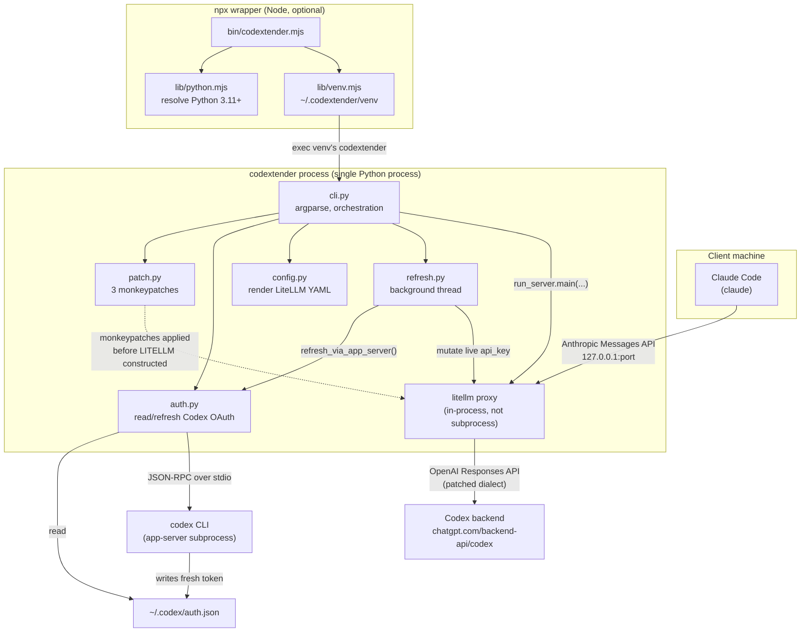
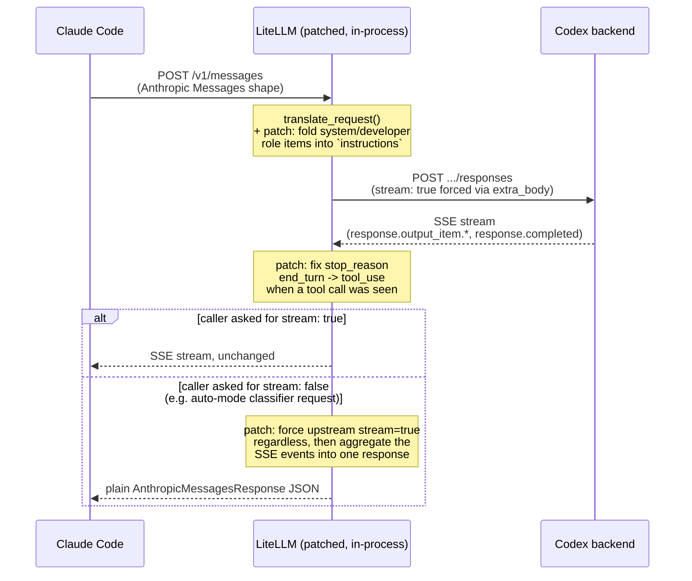
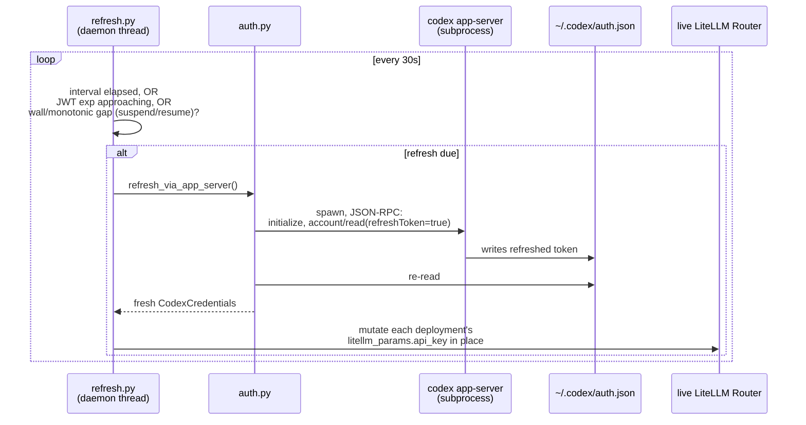
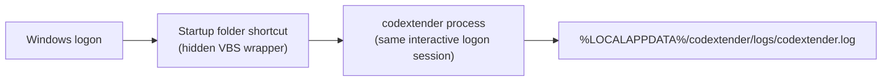
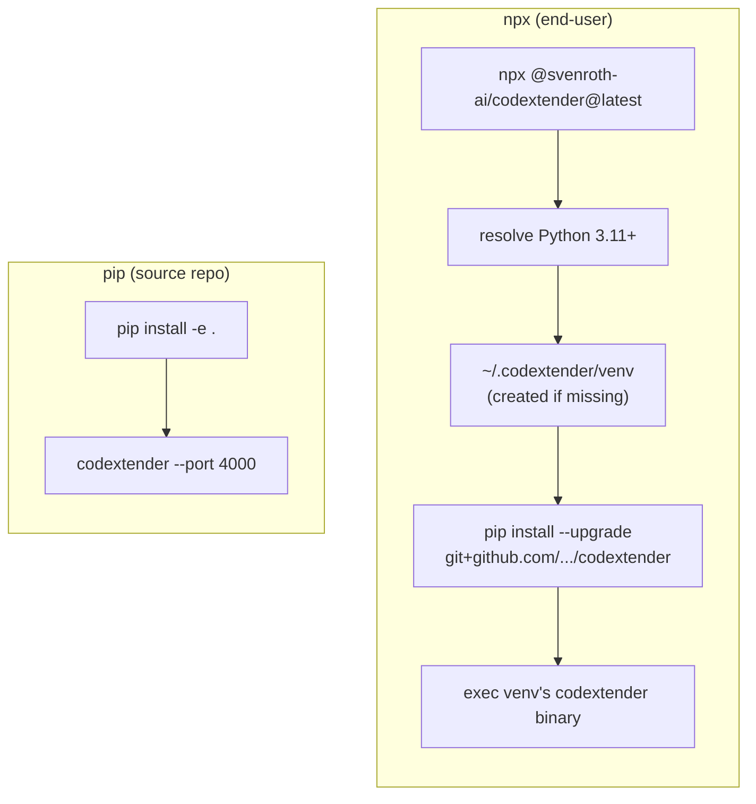

# Architecture

## What this is

codextender runs as a single local Python process: an in-process, patched
LiteLLM proxy that translates between the Anthropic Messages API (what
Claude Code speaks) and Codex's Responses API (what the Codex backend
speaks), while reusing the Codex CLI's own OAuth credentials instead of
implementing a separate login. This document describes how that's built —
the process layout, the request path, and the two ways it's installed. See
`docs/requirements.md` for *why* each piece exists, and `docs/spec.md` for
the concrete interface contract.

## Components

**Single process, not client-server-plus-sidecar.** `cli.py` runs LiteLLM's
proxy server *in the same Python process* that applied the three
`patch.py` monkeypatches — not as a subprocess via the `litellm` CLI binary.
This is load-bearing: a patch only affects the process it was applied in, so
shelling out to a separate `litellm` process would silently run unpatched.

**No static config file.** `config.render_config_yaml()` is called fresh on
every launch and written to a `tempfile.TemporaryDirectory` that's deleted
when the process exits — nothing sensitive (the OAuth access token baked
into it) is ever left on disk after a restart.

## Request flow (a normal Claude Code turn)

The three `patch.py` patches all sit on this one path, each closing a gap
where Codex's Responses-API dialect diverges from what LiteLLM (correctly,
per the documented standard) assumes. See `docs/requirements.md` FR-03/04/05
and `patch.py`'s own module docstring for the verified root cause of each.

The system-prompt fold (FR-04) also strips Claude Code's
`x-anthropic-billing-header:` line, whose content changes on every request,
before the text reaches `instructions`. Left in, it would put a different
prefix in front of Codex on every turn and defeat prefix-based prompt
caching on the backend. See `_strip_billing_header_line` in `patch.py`.

## Background token refresh

Runs concurrently with request serving (started before the blocking proxy
call, not after). A refresh failure logs a warning and keeps using the
existing token — never crashes the proxy (FR-08).

## Windows autostart

Deliberately a **Startup-folder entry, not a Scheduled Task**: on an
AzureAD/corporate-managed machine, `Register-ScheduledTask` can need
elevation just to register, and even once registered the task can silently
fail to launch anything (`LastTaskResult=1`, no process, no log line) while
the identical binary launches fine from an interactive PowerShell session —
confirmed live, 2026-09-26. A Startup-folder entry runs in that same
interactive logon session, sidestepping whatever policy distinguishes the
two. No crash-restart loop yet (the Scheduled Task version had one via
`-RestartCount`) — not replaced here.

## Distribution: two independent install paths

No PyPI package exists — GitHub is the only source for the Python package,
whether installed directly (`pip install -e .`) or indirectly through the
npm wrapper's `pip install --upgrade git+...`.

## Why litellm is pinned to an exact version

All three `patch.py` monkeypatches target specific classes/methods inside
LiteLLM's Anthropic-Responses translation internals — not LiteLLM's public
API. Pinning (`pyproject.toml`) means a future LiteLLM release can't
silently change those internals out from under the patches; a version bump
here is a deliberate act that must re-verify each patch still applies
correctly, not an accident of `pip install --upgrade` picking up something
newer.

`patch.py` also carries one diagnostic hook, `install_unknown_model_hint`,
which appends an actionable sentence to LiteLLM's "Invalid model name" 400
(the served aliases and the env var to set). It is not one of the three
Codex-compatibility patches: it only changes an error message, and a failure
to install it logs a warning instead of stopping startup. It targets
`ProxyModelNotFoundError` and needs the same re-verification on a version
bump.
